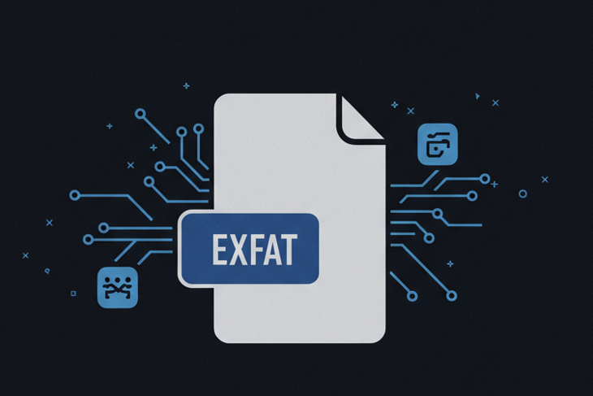

<div id="top">

<!-- HEADER STYLE: CLASSIC -->
<div align="center">



# LIBXFAT

<em>High Performance Digital Forensics</em>

<!-- BADGES -->


<!-- default option, no dependency badges. -->

<!-- default option, no dependency badges. -->

</div>
<br>

---

## Table of Contents

- [Table of Contents](#table-of-contents)
- [Overview](#overview)
- [Features](#features)
- [Project Structure](#project-structure)
  - [Project Index](#project-index)
- [Getting Started](#getting-started)
  - [Prerequisites](#prerequisites)
  - [Installation](#installation)
- [Contributing](#contributing)
- [Cite Paper](#cite)

---

## Overview

libxfat is a Go library offering a robust and efficient solution for parsing and
manipulating ExFAT filesystems. It provides comprehensive tools for extracting
data and accessing metadata.

**Why libxfat?**

This project simplifies ExFAT filesystem interaction for developers. The core
features include:

- **🟢 Robust ExFAT Parsing:** Handles both contiguous and chained cluster
  allocation schemes for reliable data extraction.
- **🔵 Comprehensive Metadata Access:** Easily retrieve file size, attributes,
  timestamps, and generate directory listings.
- **🟡 Efficient Data Extraction:** Optimized for speed and performance when
  working with large ExFAT volumes.
- **🔴 Clear Data Structures:** Well-defined structs (VBR, Entry) simplify ExFAT
  data manipulation and understanding.
- **🟣 Thorough Error Handling:** Includes integrity checks and robust error
  handling to prevent data loss.
- **🟠 Well-Documented Code:** Clean, well-commented code ensures easy
  integration and maintainability.

---

## Features

|    | Component         | Details                                                                                                                                                                                |
| :- | :---------------- | :------------------------------------------------------------------------------------------------------------------------------------------------------------------------------------- |
| ⚙️ | **Architecture**  | <ul><li>Pure Go implementation</li><li>Modular design with separate packages for different FAT functionalities</li></ul>                                                               |
| 🔩 | **Code Quality**  | <ul><li>Generally well-structured code</li><li>Uses descriptive variable and function names</li><li>Some areas could benefit from more comments</li></ul>                              |
| 📄 | **Documentation** | <ul><li>Limited documentation</li><li>Relies heavily on code comments for explanation</li><li>No formal API documentation</li></ul>                                                    |
| 🔌 | **Integrations**  | <ul><li>Designed to be easily integrated into other Go projects</li><li>No external library dependencies beyond Go's standard library</li></ul>                                        |
| 🧩 | **Modularity**    | <ul><li>Good modularity with distinct packages for file system operations, directory handling, etc.</li><li>Facilitates independent testing and maintainability</li></ul>              |
| ⚡️ | **Performance**   | <ul><li>Performance not explicitly optimized in the code</li><li>Further analysis required to determine performance characteristics</li></ul>                                          |
| 🛡️ | **Security**      | <ul><li>No explicit security measures implemented (e.g., input validation)</li><li>Security considerations need to be addressed for production use</li></ul>                           |
| 📦 | **Dependencies**  | <ul><li>Only relies on the Go standard library</li><li>No external dependencies, reducing complexity and potential conflicts</li></ul>                                                 |
| 🚀 | **Scalability**   | <ul><li>Scalability depends on the application using the library</li><li>The library itself is not inherently limited in scalability</li><li>Tested with datasets up to 1TiB</li></ul> |

---

## Project Structure

```sh
└── libxfat/
    ├── README.md
    ├── cluster.go
    ├── const.go
    ├── entry.go
    ├── exfat.go
    ├── go.mod
    ├── go.sum
    ├── struct.go
    ├── util.go
    └── vbr.go
```

### Project Index

<details open>
    <summary><b><code>LIBXFAT/</code></b></summary>
    <!-- __root__ Submodule -->
    <details>
        <summary><b>__root__</b></summary>
        <blockquote>
            <div class='directory-path' style='padding: 8px 0; color: #666;'>
                <code><b>⦿ __root__</b></code>
            <table style='width: 100%; border-collapse: collapse;'>
            <thead>
                <tr style='background-color: #f8f9fa;'>
                    <th style='width: 30%; text-align: left; padding: 8px;'>File Name</th>
                    <th style='text-align: left; padding: 8px;'>Summary</th>
                </tr>
            </thead>
                <tr style='border-bottom: 1px solid #eee;'>
                    <td style='padding: 8px;'><b><a href='https://github.com/aoiflux/libxfat/blob/master/cluster.go'>cluster.go</a></b></td>
                    <td style='padding: 8px;'>- Cluster.go` facilitates data extraction from a disk image within a larger FAT file system library<br>- It provides functions to locate and read data clusters, handling both contiguous and chained allocation schemes<br>- The code determines cluster offsets, retrieves cluster chains from the FAT table, and extracts file content based on entry metadata, writing the extracted data to a specified destination.</td>
                </tr>
                <tr style='border-bottom: 1px solid #eee;'>
                    <td style='padding: 8px;'><b><a href='https://github.com/aoiflux/libxfat/blob/master/const.go'>const.go</a></b></td>
                    <td style='padding: 8px;'>- Const.go` defines constants crucial for the libxfat library, which processes the ExFAT file system<br>- It specifies sizes, offsets, and values related to the volume boot record, file allocation table, directory entries, and other structural elements<br>- These constants are used throughout the library to correctly interpret and manipulate ExFAT data structures, ensuring proper interaction with ExFAT formatted storage.</td>
                </tr>
                <tr style='border-bottom: 1px solid #eee;'>
                    <td style='padding: 8px;'><b><a href='https://github.com/aoiflux/libxfat/blob/master/entry.go'>entry.go</a></b></td>
                    <td style='padding: 8px;'>- Entry.go<code> provides functions to format and display directory entry information within the </code>libxfat` package<br>- It offers methods to retrieve file size, determine indexability, and generate both short and long directory listings<br>- These functions facilitate user-friendly presentation of file system metadata, likely for a command-line interface or similar application.</td>
                </tr>
                <tr style='border-bottom: 1px solid #eee;'>
                    <td style='padding: 8px;'><b><a href='https://github.com/aoiflux/libxfat/blob/master/exfat.go'>exfat.go</a></b></td>
                    <td style='padding: 8px;'>- Exfat.go` provides functionality for interacting with the ExFAT filesystem<br>- It offers methods to retrieve allocated and free cluster counts, extract file contents, and list directory entries<br>- The code traverses directory structures, allowing for file extraction and detailed information display<br>- These functions are integral to the projects ability to explore and manipulate ExFAT volumes.</td>
                </tr>
                <tr style='border-bottom: 1px solid #eee;'>
                    <td style='padding: 8px;'><b><a href='https://github.com/aoiflux/libxfat/blob/master/go.mod'>go.mod</a></b></td>
                    <td style='padding: 8px;'>- Go.mod<code> declares the module </code>github.com/aoiflux/libxfat<code> for the Go project, specifying Go version 1.21<br>- It serves as the projects manifest, defining the projects identity and dependencies within the larger </code>github.com/aoiflux` organization<br>- This file is crucial for dependency management and build processes, ensuring consistent and reproducible builds across different environments.</td>
                </tr>
                <tr style='border-bottom: 1px solid #eee;'>
                    <td style='padding: 8px;'><b><a href='https://github.com/aoiflux/libxfat/blob/master/go.sum'>go.sum</a></b></td>
                    <td style='padding: 8px;'>- Go.sum` records checksums of dependencies, ensuring the integrity and reproducibility of the Go project<br>- It acts as a security measure, preventing unauthorized modification of downloaded packages<br>- Within the broader project architecture, it safeguards against dependency vulnerabilities and guarantees consistent builds across different environments<br>- This file is crucial for maintaining the reliability and security of the application.</td>
                </tr>
                <tr style='border-bottom: 1px solid #eee;'>
                    <td style='padding: 8px;'><b><a href='https://github.com/aoiflux/libxfat/blob/master/struct.go'>struct.go</a></b></td>
                    <td style='padding: 8px;'>- Struct.go<code> defines data structures for representing an ExFAT filesystem<br>- It introduces </code>VBR<code> to encapsulate the Volume Boot Record information and </code>Entry<code> to represent directory entries<br>- The code provides methods for manipulating and querying these structures, facilitating ExFAT filesystem parsing and analysis within the </code>libxfat<code> package<br>- </code>ExFAT<code> struct manages the overall filesystem representation, using </code>VBR<code> and </code>Entry` to access and process filesystem metadata and data.</td>
                </tr>
                <tr style='border-bottom: 1px solid #eee;'>
                    <td style='padding: 8px;'><b><a href='https://github.com/aoiflux/libxfat/blob/master/util.go'>util.go</a></b></td>
                    <td style='padding: 8px;'>- Util.go` provides utility functions for the libxfat library, aiding in EXFAT filesystem processing<br>- It offers functions for validating entry types, counting bits in bitmaps, handling Unicode conversion from ASCII, formatting timestamps, interpreting file attributes, and converting byte sizes to human-readable formats<br>- These functions streamline data manipulation and presentation within the larger EXFAT parsing and analysis process.</td>
                </tr>
                <tr style='border-bottom: 1px solid #eee;'>
                    <td style='padding: 8px;'><b><a href='https://github.com/aoiflux/libxfat/blob/master/vbr.go'>vbr.go</a></b></td>
                    <td style='padding: 8px;'>- Vbr.go<code> parses the Volume Boot Record (VBR) of an exFAT file system<br>- It reads VBR data from a disk image, verifies its integrity using signature checks and sync values, and extracts key metadata<br>- This metadata includes volume size, FAT location and size, data region offset, cluster information, and other essential parameters<br>- The parsed VBR data is crucial for subsequent file system operations within the </code>libxfat` library.</td>
                </tr>
            </table>
        </blockquote>
    </details>
</details>

---

## Getting Started

### Prerequisites

This project requires the following dependencies:

- **Programming Language:** Go
- **Package Manager:** Go modules

### Installation

Build libxfat from the source and intsall dependencies:

1. **Clone the repository:**

   ```sh
   ❯ git clone https://github.com/aoiflux/libxfat
   ```

2. **Navigate to the project directory:**

   ```sh
   ❯ cd libxfat
   ```

3. **Install the dependencies:**

<!-- SHIELDS BADGE CURRENTLY DISABLED -->

    <!-- [![go modules][go modules-shield]][go modules-link] -->
    <!-- REFERENCE LINKS -->
    <!-- [go modules-shield]: https://img.shields.io/badge/Go-00ADD8.svg?style={badge_style}&logo=go&logoColor=white -->
    <!-- [go modules-link]: https://golang.org/ -->

    **Using [go modules](https://golang.org/):**

    ```sh
    ❯ go build
    ```

---

## Contributing

- **💬 [Join the Discussions](https://github.com/aoiflux/libxfat/discussions)**:
  Share your insights, provide feedback, or ask questions.
- **🐛 [Report Issues](https://github.com/aoiflux/libxfat/issues)**: Submit bugs
  found or log feature requests for the `libxfat` project.
- **💡
  [Submit Pull Requests](https://github.com/aoiflux/libxfat/blob/main/CONTRIBUTING.md)**:
  Review open PRs, and submit your own PRs.

<details closed>
<summary>Contributing Guidelines</summary>

1. **Fork the Repository**: Start by forking the project repository to your
   github account.
2. **Clone Locally**: Clone the forked repository to your local machine using a
   git client.
   ```sh
   git clone https://github.com/aoiflux/libxfat
   ```
3. **Create a New Branch**: Always work on a new branch, giving it a descriptive
   name.
   ```sh
   git checkout -b new-feature-x
   ```
4. **Make Your Changes**: Develop and test your changes locally.
5. **Commit Your Changes**: Commit with a clear message describing your updates.
   ```sh
   git commit -m 'Implemented new feature x.'
   ```
6. **Push to github**: Push the changes to your forked repository.
   ```sh
   git push origin new-feature-x
   ```
7. **Submit a Pull Request**: Create a PR against the original project
   repository. Clearly describe the changes and their motivations.
8. **Review**: Once your PR is reviewed and approved, it will be merged into the
   main branch. Congratulations on your contribution!

</details>

<details closed>
<summary>Contributor Graph</summary>
<br>
<p align="left">
   <a href="https://github.com{/aoiflux/libxfat/}graphs/contributors">
      
   </a>
</p>
</details>

---
## Cite
Gogia, G., & Rughani, P. (2024). Parex: A novel exfat parser for file system
forensics. Computación y Sistemas, 28(2). https://doi.org/10.13053/cys-28-2-4804
---
